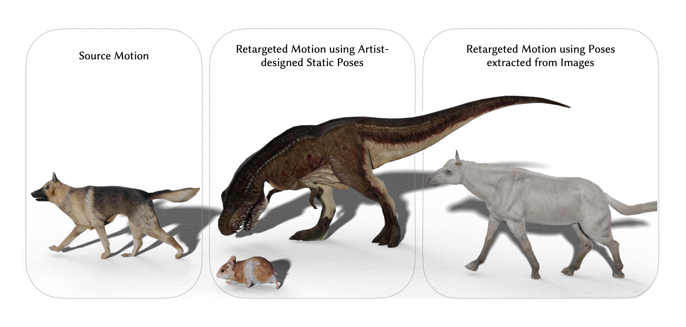

## Pose-to-Motion: Cross-Domain Motion Retargeting with Pose Prior - submission 
PyTorch implementation for Pose-to-Motion: Cross-Domain Motion Retargeting with Pose Prior.


## Set up environment
To setup a conda environment use these commands
```
conda env create -f environment.yml
conda activate pose2motion
```

## Download data
Download the data from [here](https:/) and extract it to the root directory of the project.

## Training
To train the model for mixamo dataset, run the following command
```
python run_all_wgan_mixamo.py
```

## User Study
check out [user_study.md](https://github.com/github-anonymous-submission/pose2motion_submission/blob/main/user_study/user_study.md) for more details.


## Acknowledgement
Code takes inspiration from [CycleGAN](https://github.com/junyanz/pytorch-CycleGAN-and-pix2pix), [Adversial Parametric Pose Prior](https://github.com/junyanz/pytorch-CycleGAN-and-pix2pix) and [Deep-Motion-Editing](https://github.com/DeepMotionEditing/deep-motion-editing). 
