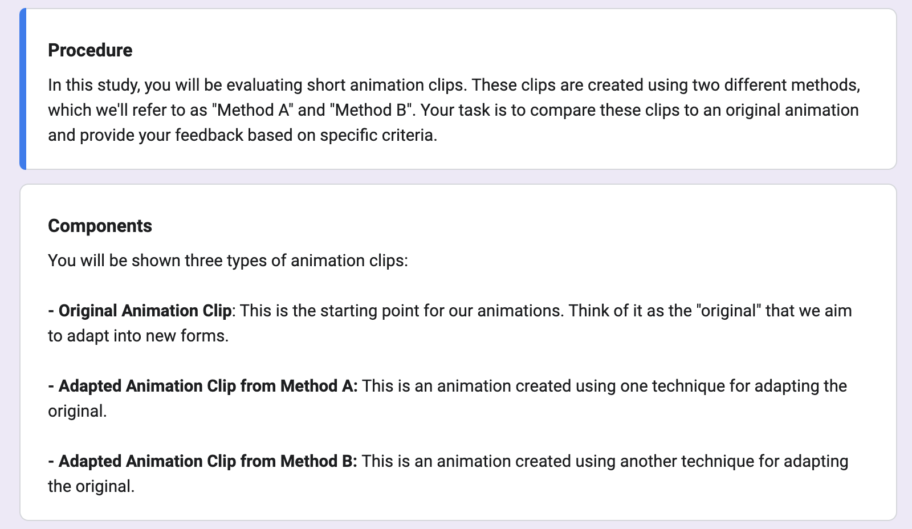
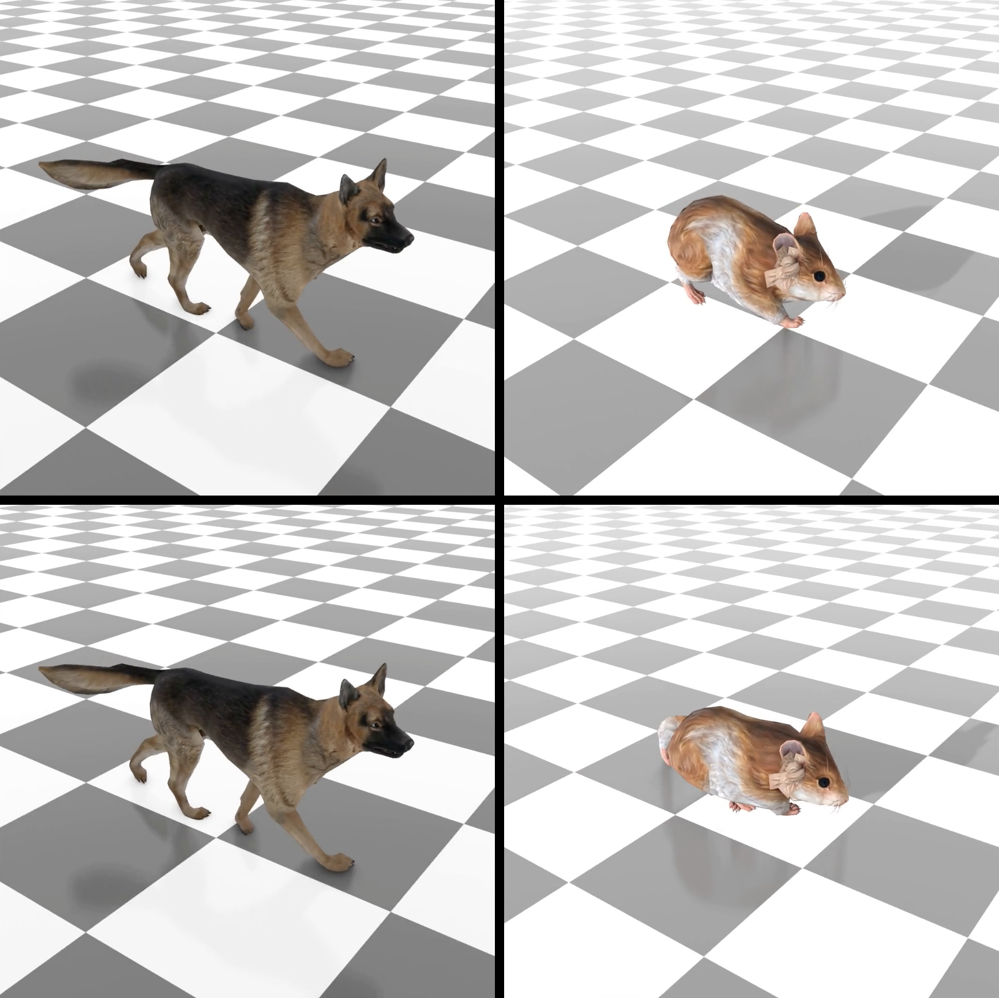

## Pose-to-Motion: Cross-Domain Motion Retargeting with Pose Prior - User Study

We perform a user study to evaluate the quality of the generated motions. We compare our method with the [MotionBuilder](https://www.autodesk.com/products/motionbuilder/overview?term=1-YEAR&tab=subscription).

Our study sampled 9 motion clips, three per character,  from different motion categories (walking, running, and turning). Within each category, the target motion is randomly sampled to minimize bias. The anonymous participants are from within and outside of our university. 

### User Study Form
The sample form can found access [here](https://forms.gle/u2WNyWgoF2sPcGS4A). As the videos in the original user study are hosted on non-anonymous page, we only show part of the user study here. \

### User Study Video
The sample video shown can be see below. All video are synchronized to start at the same time and the order of ours vs motion builder is randomized.
See - [here](https://github.com/github-anonymous-submission/pose2motion_submission/blob/main/user_study/user_study_sample.mp4) for a sample video used in the user study.
<!-- include video -->

<!-- <video width="50%" height="50%" controls>
  <source src="user_study_sample.mp4" type="video/mp4">
</video> -->
